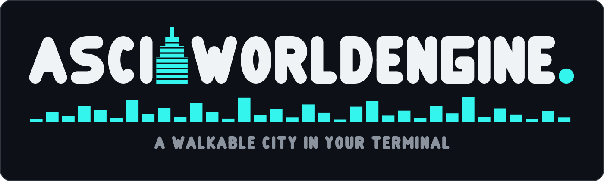
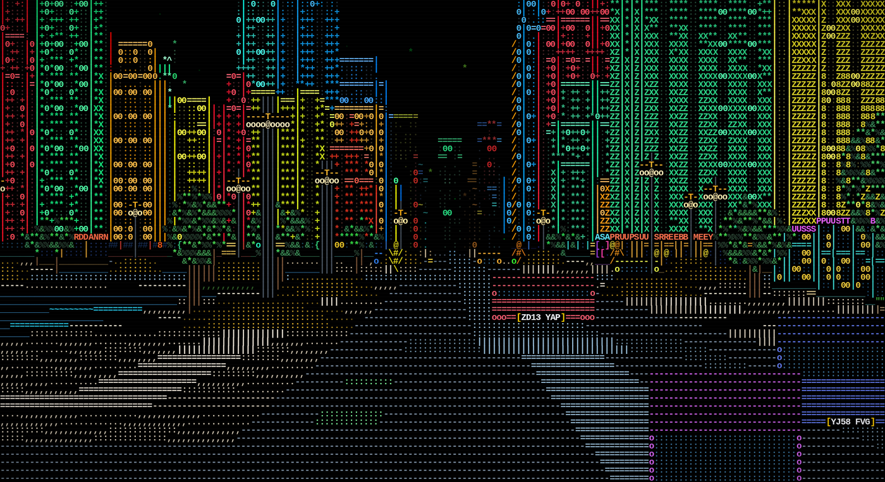
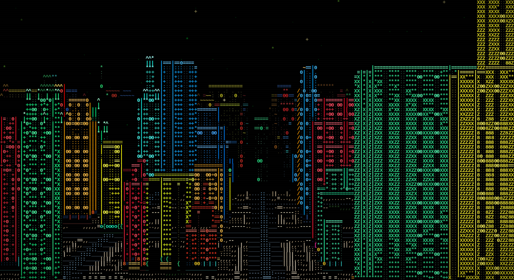
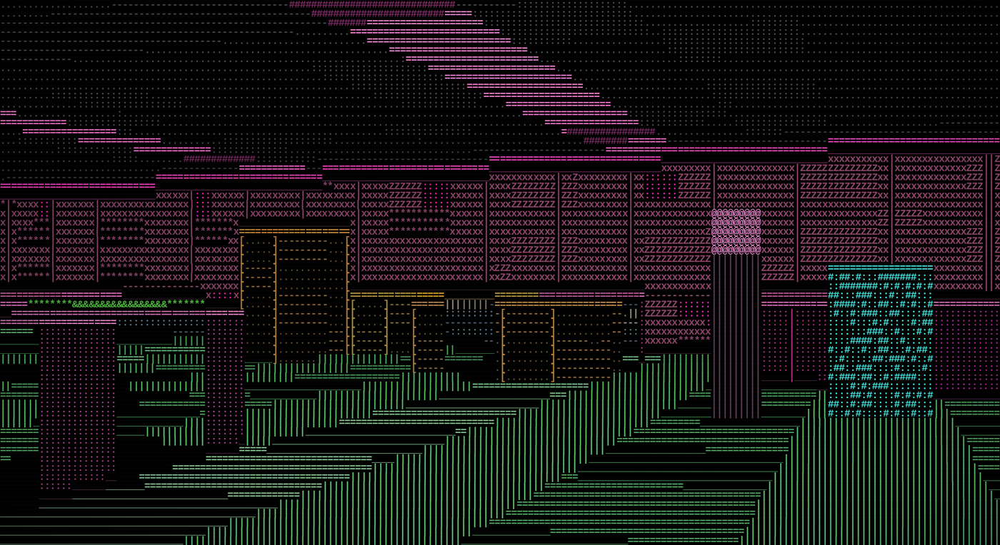
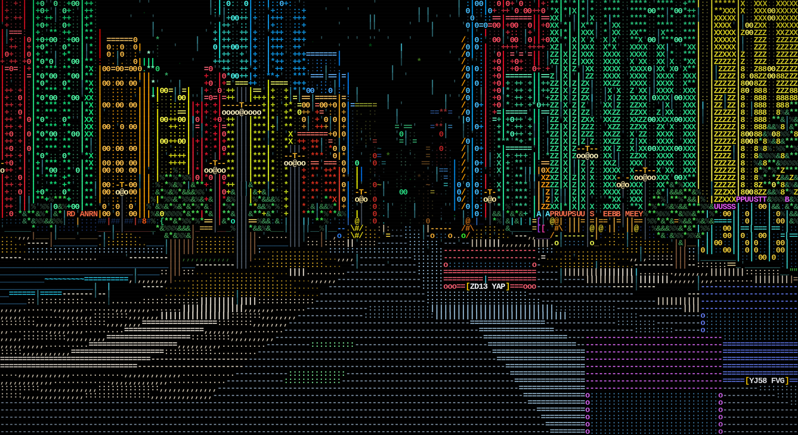

<p align="center">
  <a href="docs/brand/README.md"></a>
</p>

<p align="center"><sub>
  With thanks to <a href="https://grownowgames.com"><b>Grow Now! Games</b></a>, the inspiration for this project.
</sub></p>

---

A cyberpunk city, drawn out of characters, that you can walk around in — down
the avenues, in through the doors, up to the rooftops. There is no engine
underneath it: the world, the camera, the projection, the raycaster, every
glyph and every colour are written from scratch in Rust and painted straight
into your terminal.

It is not a screensaver and it is not a video. It is a real 3D world, generated
as you move through it, running faster than your monitor can show you.



## Key details

|  |  |
|---|---|
| **Native Rust** | one crate, and exactly one dependency (`libc`, for termios). No browser, no runtime, no node, no wasm on the default path |
| **0.577 ms a frame** | 180×60, measured on the current build — a 1,730 fps ceiling. [What a frame costs](docs/performance.md) |
| **3.2 MB resident** | there is no world grid; every cell is a pure function of its coordinate, so the city is **unbounded** and walking further costs nothing |
| **The world** | avenues and junctions, towers with six different silhouettes, lit storefronts, traffic carrying **readable registration plates**, pedestrians, lampposts, street trees, rain you can turn on, and a star field behind it all |
| **The insides** | every street-facing building has a door. Walk through it and you are in a real room — furniture, fixtures, and a glazed wall you can see the actual city through |
| **Runs anywhere a terminal does** | 24-bit ANSI; it sizes itself to your window |

## Run it

One command, from nothing to standing on a pavement:

```bash
git clone https://github.com/Alchemy86/AsciiWorldEngine.git && cd AsciiWorldEngine && ./play
```

`./play` finds a Rust toolchain (offering to install one if there is none),
builds in release, and drops you into the city. Everything you pass it goes
straight through — `./play --demo`, `./play --help`, and every flag below.

## Controls

| key | | key | |
|---|---|---|---|
| `W` `A` `S` `D` / arrows | walk and strafe | `J` `K` | turn |
| `R` `F` | look up / down | space or shift | sprint |
| `E` `C` / PgUp PgDn | rise / sink | `V` | street ↔ elevated vista |
| `T` | weather: clear / rain / downpour | `Tab` | lock a walk on |
| `M` | hand over to the autopilot | `P` | write the frame to disk |
| `Q` or Esc | quit | | |

Keys are held for exactly as long as your finger is on them in any terminal
that speaks the kitty keyboard protocol, and there is a measured fallback for
the ones that do not — [Holding a key down](docs/terminal-input.md).

## Pictures

Every one of these is a real frame out of the engine, same seed, same city.

**Up on the observation deck.**



**Inside a bar. The floor, the walls, the ceiling and the furniture are all geometry.**



**The same street in a downpour.**



## Examples

```bash
./play --demo                                 # the city walks itself; any key takes over
./play --seed 90210                           # a different city, same rules
./play --plates "AB12 CDE,K9 PAW,1 RG"        # put your own plates on the traffic
./play --weather downpour --variety 0.4       # wetter, and a more regular district
./play --vista --out shots --name skyline     # one skyline frame, to .svg and .txt
./play --doorway --out shots                  # in through a door and back out, as frames
./play --film --weather rain --out frames     # every tick, ready for ffmpeg
./play --bench                                # per-frame cost: sim / cast / render / paint
```

## Coming next

- **A glass elevator.** Step into the car in a tall building, press the panel,
  and watch the floors go past on one side and the street fall away on the
  other. Being built now — glazing is a property of a *cell*, so a car glazed
  on four sides sees out on four sides while it moves.
- **Floors above the first.** `Interior::build` already takes a storey and a
  slab height, and `Cell::height` is absolute world height, so a wall on the
  thirty-first floor is simply a tall one.
- **Fixtures you can use.** Every terminal, notice board and exit sign in a
  room already carries a label, a verb and a reach, and the HUD tells you what
  is within arm's length. Pressing the key is the part that is missing.
- **More than a terminal.** The engine decides the whole picture and hands a
  frontend one flat buffer of characters and colours; a frontend only paints
  it. The terminal is one. A browser canvas is already another
  ([`./build-wasm.sh`](docs/architecture.md)). Anything that can paint a grid
  of coloured cells can be the next.

## Deeper

| | |
|---|---|
| [The shape of the engine](docs/architecture.md) | crate layout, the no-grid world, the projection, the browser target |
| [Generating the city](docs/world-generation.md) | blocks and plots, six building silhouettes, the `--variety` knob |
| [Doors, rooms and windows](docs/interiors.md) | how inside and outside are one mode, and how you see out |
| [Registration plates](docs/registration-plates.md) | drawn out of characters, sized to the registration, honest at distance |
| [Weather and what is on the pavement](docs/weather-and-streets.md) | rain, stars, lamps, trees |
| [Recording a film](docs/film.md) | `--film`, the script format, the ffmpeg pipeline |
| [The city walking itself](docs/self-playing.md) | `--demo`, and how it differs from a recording |
| [Holding a key down](docs/terminal-input.md) | what a terminal can and cannot tell you |
| [What a frame costs](docs/performance.md) | the measured numbers, and how they were measured |
| [Brand](docs/brand/) | the mark, the palette, and how to regenerate it |

## Licence

All rights reserved. This is proprietary software — see
[`LICENSE`](LICENSE) for the full terms and how to request permission to use,
copy, modify, or distribute it.
