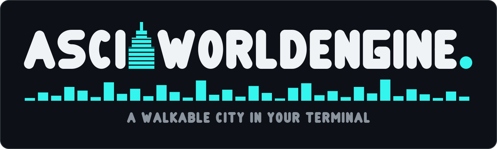

# AsciiWorldEngine brand

**The final mark is [`asciiworldengine-logo.svg`](asciiworldengine-logo.svg), and its
square icon lockup is [`asciiworldengine-icon.svg`](asciiworldengine-icon.svg). These two
files are the only ones to ship — anywhere.**



The composition is the house one, shared with the sibling projects: one heavy geometric
wordmark, tight-tracked, white on a near-black panel; the motif **replacing one letter**;
a single accent-colour **full stop** closing the word; and the tagline underneath,
lighter, grey, wide-tracked.

What is this project's own is the **motif** and the **accent**.

* **The tower** stands where the second I of ASCII would be. The letter is a vertical bar
  already, and this engine's world generator builds towers out of exactly this shape — a
  wide base, two setback rings, a crown and a mast on top, which are four of the six
  building profiles in [`src/world.rs`](../../src/world.rs). It is drawn with a hard flat
  top and square shoulders against an alphabet of round terminals, so it reads as
  architecture standing in a line of letters rather than as another glyph, and its storeys
  are struck out in the panel colour the way a lit facade reads in the engine: rows, not
  speckle.
* **The skyline** under the wordmark is the same idea at street scale — the city the
  tagline is talking about, one block of it, on one pavement.
* **The accent is the engine's own colour.** `#34f4ee` is `hsl(178, 90%, 58%)`, the
  `NEON_GRID` frame hue out of [`src/palette.rs`](../../src/palette.rs). It is the teal
  that dominates every capture in [`docs/frames/`](../frames/), so the mark and the
  product agree rather than merely coexist.

Everything here is **hand-authored**: the letterforms are original stroked skeleton paths
drawn in [`generate.py`](generate.py); **no font is embedded, subset or traced**, so there
is no third-party licence in any of these files. The whole vocabulary is a tower, a
skyline and a full stop.

Regenerate deterministically with `python3 docs/brand/generate.py` — **edit the generator,
never the SVGs by hand** — and re-render the previews in the same commit:

```bash
cd docs/brand
magick asciiworldengine-logo.svg preview/logo.png
magick asciiworldengine-icon.svg preview/icon-128.png
magick -background none asciiworldengine-icon.svg -resize 16x16 preview/icon-16.png
```

Every SVG paints its own panel with a faint border, so it survives GitHub light mode, dark
mode and a pure-black page — nothing here is theme-conditional, so the
`prefers-color-scheme` trap never arises.

## Palette

| | | |
|---|---|---|
| panel | `#0d1117` | near-black; matches GitHub dark and holds on light |
| border | `#30363d` | faint, so the card still reads on a pure-black page |
| wordmark | `#f0f3f6` | off-white |
| tagline | `#8b949e` | grey |
| **accent** | **`#34f4ee`** | `hsl(178, 90%, 58%)` — the engine's `NEON_GRID` frame hue |

## Tagline

> **A WALKABLE CITY IN YOUR TERMINAL**

The shortest honest description of the project: you walk it, it is a city, and it is drawn
out of characters into a terminal.

## Using the mark elsewhere (avatars, favicons)

Copy **`asciiworldengine-logo.svg`** for a page header or hero and
**`asciiworldengine-icon.svg`** for an avatar or favicon; this file is the source of truth
for which files those are. The icon is the wordmark's motif distilled — the setback tower
with a neighbour either side, on a pavement — and stays legible at 16 px
([`preview/icon-16.png`](preview/icon-16.png) is the real favicon test, not a resized
illustration).

## Files

- [`asciiworldengine-logo.svg`](asciiworldengine-logo.svg) — **the** wordmark lockup, 1400×420
- [`asciiworldengine-icon.svg`](asciiworldengine-icon.svg) — **the** square icon lockup, 128×128
- [`preview/logo.png`](preview/logo.png), [`preview/icon-128.png`](preview/icon-128.png),
  [`preview/icon-16.png`](preview/icon-16.png) — rendered previews at hero, avatar and
  favicon size
- [`generate.py`](generate.py) — the only source of truth; edit it, never the SVGs by hand
