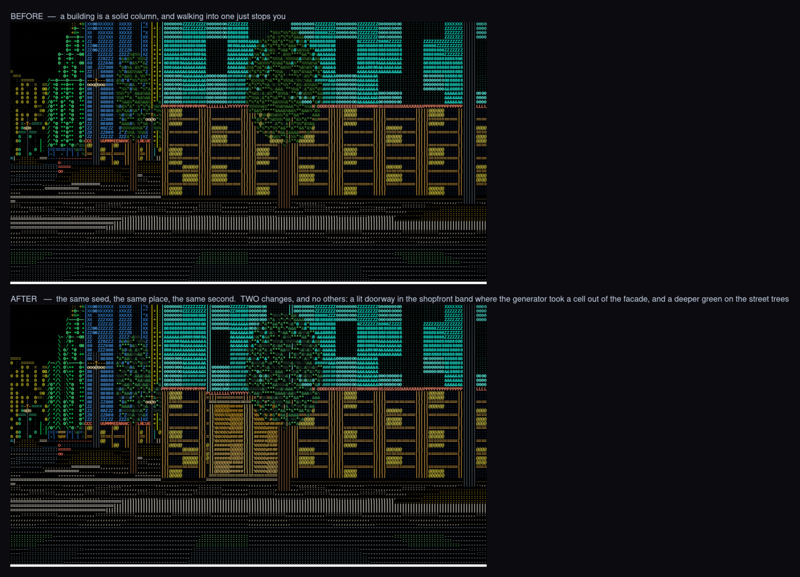
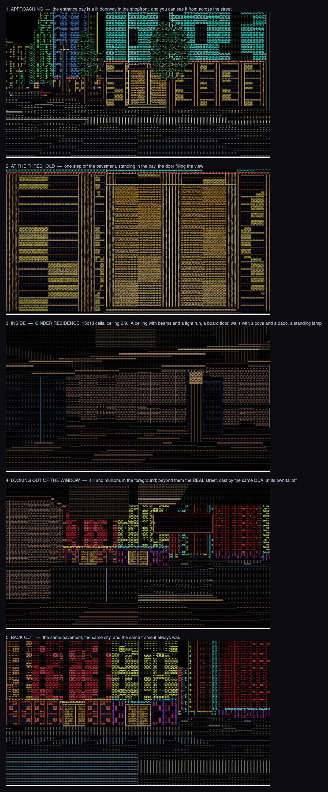

# Doors, rooms and windows you can see out of

A building used to be a solid column, and walking into one just stopped you.
Now the world generator puts an **entrance** on every building that faces a
street, stepping through it puts you **inside a real room**, and the room's
street wall is **glazed** — so from in there you are looking at the actual
city.

```bash
cargo run --release -- --doorway        # approach / threshold / inside / window / back out
cargo run --release -- --bench --indoors
```


## Inside and outside are a mode the engine is in

Not a special case in the renderer. `World::place` is either `Outdoors` — the
city, still a pure function of coordinate, still holding nothing — or
`Indoors(Interior)`, one real grid of one room. `World::cell` answers from
whichever it is, so the raycaster, the collision and the depth buffer all
follow without knowing there are two. The renderer picks its whole pass list
off the same enum: sky / ground / walls / props / population / rain out there,
ceiling / floor / room walls / fixtures in here.

|  | |
|---|---|
| **the door** | two cells of the outer ring of a street-facing plot, taken out down to the pavement, with the wall behind them drawn as a **lit doorway**. You can see where you can go in from across the street. |
| **the transition** | walk through a threshold and the mode changes; walk back through it and it changes back. Nothing is teleported: a room is built in the SAME world coordinates as its doorway, so you are standing in the same cell the instant before and the instant after. |
| **the room** | generated from the building's own hash, so a given building is always the same inside. Ten families — lobby, offices, market, workshop, gallery, concourse, residence, plant, bar, archive — and inside a family the size, the ceiling height, the light, the floor material, the layout and every piece of furniture come off the seed. |
| **the windows** | a glazed bay is a cell with a **sill** you cannot climb over and clear air above it. Anywhere the room's grid has nothing to say, `World::cell` falls through to the **city** — so the same DDA that found the wall carries straight on out into the street and hits real buildings at real distances. There is no backdrop and no parallax to fake. |
| **the obstacles** | a thing you cannot walk through IS geometry, so furniture is baked into the room's cells and goes through the same collision and the same raycaster a wall does. What is NOT geometry — a terminal, a notice board, the exit sign — is a `Fixture` carrying a label, a verb and a reach, and `Interior::interaction_near` answers with it. The HUD says what is within reach. |

Rooms are addressable by floor: `Interior` carries a floor number and a slab
height and assumes nothing about either, so the vertical dimension is not
hardcoded to one storey.

## What it did to the street

`doorway-street.png` is the same seed from the same place, before and after —
the street view changes in exactly two ways, and both of them are the point:



`interiors.png` is one walk: up to the door, through it, standing in the room,
looking out of its window, and back on the pavement.



## Colour inside

A room's floor, its walls and its ceiling each get their own hue rather than
one haze over all three, and the light level steps down from the street without
going dark: an interior that matched the street's brightness read as outdoors
with a lid on, and one that dropped far enough to be obviously indoors could
not be read at all. See [Performance](performance.md) for what the whole of it
costs.
