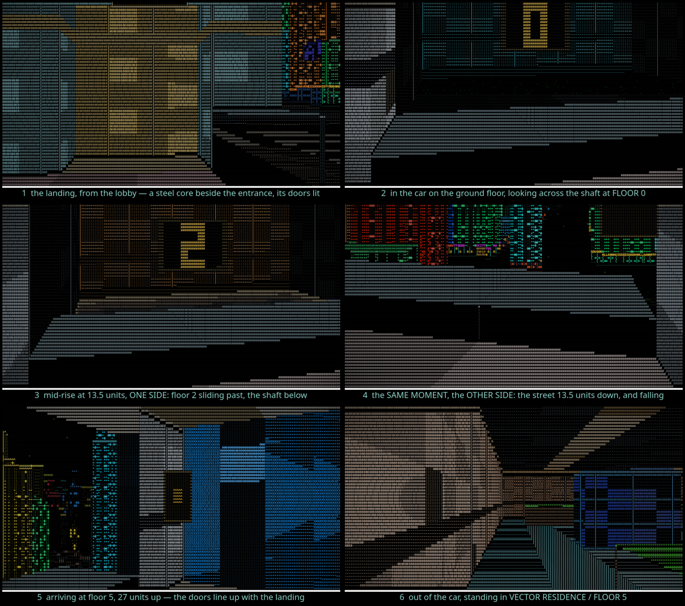

# A glass lift, and the floors going past it

A building tall enough to want one gets a **lift**. You walk in off the street,
walk into the car, and **press the panel** — and the car takes you up, past the
floors on one side and above the street on the other.

```bash
cargo run --release -- --lift            # landing / in the car / mid-rise / arriving
cargo run --release -- --bench --lift-bench
```



## A car is a room that moves

That is why nothing else had to change. `World::place` is still `Outdoors` or
`Indoors(Interior)`; the car **is** an `Interior`, with a `Lift` on it for the
one thing a room does not have — a `base` that changes. The raycaster, the
collision, the depth buffer and the renderer's pass list never learned that
lifts exist.

|  | |
|---|---|
| **which buildings** | the world generator decides, off the same seed, so a given building always has one or always does not. It needs the height to justify it (`lift::MIN_HEIGHT`, measured at the building's own entrance, which is where the shaft is cut) and enough frontage to stand a core on clear of its own doorway. About half of the entrances in a slab of city have one, serving four to ten floors. |
| **the core** | a solid steel box beside the entrance, with two doors in the flank that faces you as you walk in and a lit **LIFT** sign over them. Inside it is a shaft: the car at the front of it, an open well behind, and a wall at the back of that. |
| **the panel** | interaction is one bit of the input bitmask — `X` or `Enter` — and the world model decides what it means: the nearest fixture within reach is the thing you are acting on. In a car that is one of the **two call buttons**, one at each end, so which one is under your hand is which one you are standing at. The HUD says which before you press. It is a deliberate act, not a trigger you walk into. |
| **the ride** | one press is one floor, and pressing again on the way extends it. The car's height is a smoothstep over the trip, so it eases out and eases in, and **there is no setting of it that jumps a floor**. The camera stands on the car's slab, so going up reads as going up. |
| **the floors** | the shaft wall is textured from the building's own **storey table** — the same table each floor's room is built from and the only heights the car may stop at. Each floor is a lit band in its own colours over its own slab, with its number stencilled on it, keyed to ABSOLUTE world height so the floors hold still in the world and slide down past the glass as you rise. The floor you watch go by is the floor you step out into. |
| **the street** | the car's outward glass is a cell whose grid simply stops, so `World::cell` falls through to the **city** — the same mechanism a room's window uses. Rising forty units up a shaft is the camera move the elevated vista already makes, so the street falls away underneath you for free and correctly. |
| **the doors** | shut unless the car is standing level. That is the whole interlock, and it is why you cannot walk out of a moving lift. |

## The shaft is that deep and that wide for a reason you cannot see

The vertical field of view is about 40 degrees and the horizontal about 57. A
surface an arm's length away therefore shows about **one world unit of its own
height**, however tall it really is — so a shaft wall right behind the glass is
a stripe going past, not a floor. `lift::CORE_D` sets the back wall nine cells
in, far enough for that cone to cover a storey and a bit of one at a time, and
`lift::CORE_W` makes the well five units across so it fills two thirds of the
frame instead of being a slot in a screen of dark side wall.

Both numbers are rendering requirements before they are architectural ones, and
both are written down in `src/lift.rs` because they do not look like
requirements.

## Floors above the first

The room on every storey of a lift building is generated the same way the
ground floor always was, and the storey table is what tells it which storey it
is. The **footprint** half of the generator — how big the room is, where it
sits, where the core stands — comes off a key with the floor number left out,
so a shaft lands on the same cells floor after floor. The **character** half —
the family, and with it the colours, the ceiling height, the layout and every
piece of furniture — comes off a key with it in, so floor 3 and floor 4 are two
different rooms in one building.

Floor zero's per-floor key *is* the floor-blind key, which is what keeps every
ground-floor room in the city bit-identical to the build before lifts existed.

## What it did to the street

Nothing, to the byte. `--vista` on six seeds and three scripted `--capture`
walks come out identical against the build before this. The street bench moves
**+0.009 ms of a 0.587 ms frame**, three fifths of it in a paint stage the lift
does not touch and which is encoding those same identical bytes — that is the
binary being bigger, not the street doing anything new. See
[Performance](performance.md) for the numbers, the null control that makes them
credible, and the cost of riding one.
