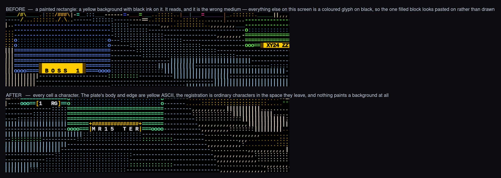
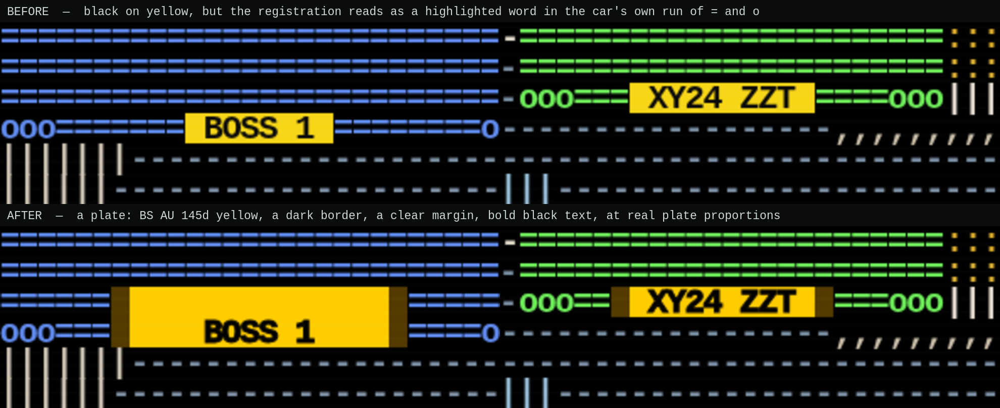
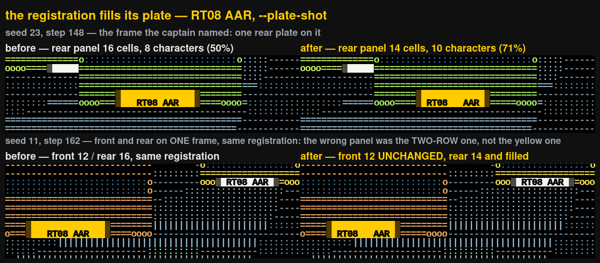
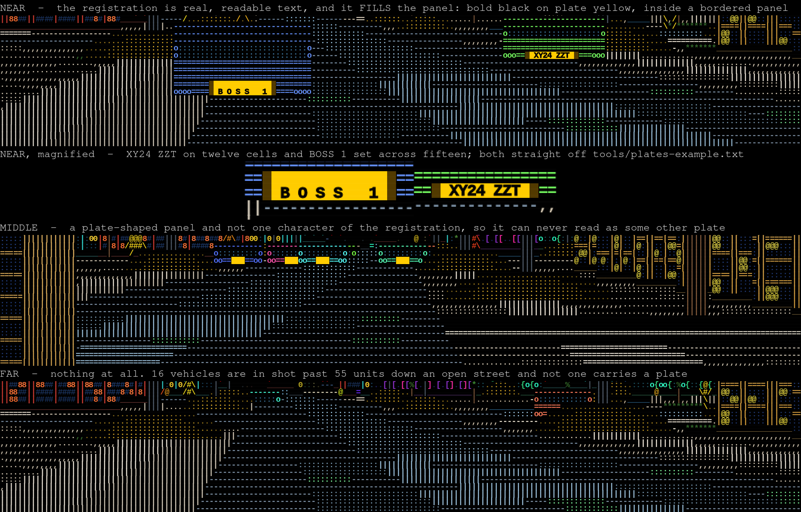

# Registration plates

Every car on the road carries one, and close up it is **real readable text**.

```bash
cargo run --release -- --plates "AB12 CDE,K9 PAW,1 RG"
cargo run --release -- --plates-file tools/plates-example.txt
cargo run --release -- --no-plates            # do not draw them at all
cargo run --release -- --plate-shot --plates-file tools/plates-example.txt
```

## A plate is drawn out of characters, like everything else on this screen

It used to be a painted rectangle — a BS AU 145d yellow background with black
ink on it — and that read correctly and was the wrong medium: every other thing
in this city is a coloured glyph on black, so the one filled block in the middle
of it looked pasted on rather than drawn. Now the plate's body and edge are
yellow ASCII and the registration is ordinary characters in the space they
leave:

```text
        +###############+
  ooo===|M R 1 5   T E R|===ooo        [1   RG]
```

Nothing about a plate paints a background any more. The rules are `#` and their
corners `+`, the uprights `|`, and a one-row plate closes with `[` `]` — **none
of them a character the bodywork is drawn with**, which is what stops a plate's
top and bottom dissolving into the back of the car. There is one colour now,
front and rear: a white frame on black reads as interface furniture rather than
as a plate, and it collides with the near-white the registration is set in.

`plate-ascii.png` is the near band before and after:



On a car with the height for it the plate is two or three rows deep, which is
what makes it read as a rectangle bolted to the back of a car rather than as a
highlighted word. `plate-look.png` is the same two cars in the same frame of
the same walk, before and after that work:



## The panel is sized to the registration on it

A cell is a fixed size, so there is no larger size to draw a character at —
what there is, is how much of the plate the characters cover, and that is the
whole of it. The two-row panel used to be a flat sixteen cells whatever it
carried, so an eight-character registration sat in the middle of it with four
cells of bare yellow at each end. Now the panel takes the width the
registration is set at, and the registration is set at one of three even
pitches — `RT08 AAR`, `RT08   AAR`, `R T 0 8   A A R` — whichever lands nearest
the width that height of plate wants to be. The group gap opens before the
character gaps do, the way a real plate's does.

The sizing survived the change to characters unaltered; what moved is that a
plate now spends **two** cells on its own body rather than four, because a
drawn upright does the job the old dark edge and clear margin did between them.
That is two more cells of registration at the distance where it decides whether
a plate can be read at all.

`plate-size.png` is the same frames before and after. The second pair is a
frame carrying a white plate and a yellow one at once, both reading the same
registration, which is what shows the difference was never front against rear:



## Supplying your own

`--plates` takes a comma-separated list and `--plates-file` a file with one
registration per line (blank lines and `#`-comments skipped). Both may be
given, and either more than once; the entries all land in one pool. Entries are
folded to upper case and anything a plate cannot carry is dropped, so
`ab12-cde` and `AB12 CDE` are the same plate; a plate is cut to 10 characters.

**With no list given** the traffic carries registrations **generated from the
seed** so the feature is visible out of the box. Those are plausible-looking
patterns — they are *not* real registrations and are not claimed to belong to
anybody. The binary says so whenever it says how many plates it has.

A car keeps its plate for as long as it is on the road, and the same `--seed`
always hands the same cars the same plates. It may take a new one when it is
recycled out of the live disc, which is a car you have never seen before.

## It degrades honestly with distance

The middle band is the point of the design: a plate is drawn as characters
**only while every character of it fits** between the wheels — and only while
the whole of it is visible. Otherwise it is a blank panel of the right size and
colour, and past about 70 units it is nothing at all. It never abbreviates,
never drops a character and is never half-drawn, because a plate that reads as
some *other* registration would be worse than no plate.

`--plate-shot` writes the three bands out as evidence frames; `plates.png` is
what it produced:



```bash
cargo run --release -- --plate-shot --plates-file tools/plates-example.txt \
    --out docs/frames --name plates
```

`--plate-shot` drives the same simulation the game does, scores every frame on
the plates themselves — read off the grid's background plane, which nothing but
a plate ever paints — and writes the best frame for each of the three bands as
`.svg` and `.txt`. It also prints which registrations from your list appear
verbatim in the frame's own characters, which is the honest legibility check:
the frame's characters are the characters a reader sees.

See [Performance](performance.md) for what all of this costs per frame.
