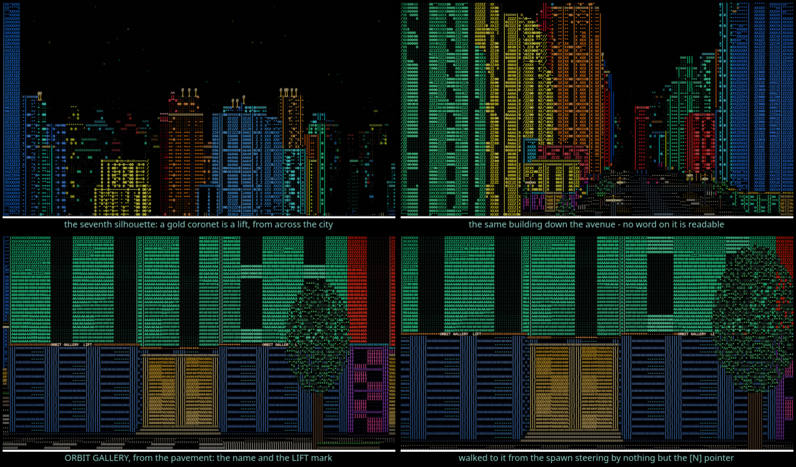

# Finding your way: a name on a building, a shape you can see coming

The city is **unbounded**, so wandering is not a strategy. Before this, nothing
in it was named where a player could see: a building had a name in the world
model and `--lift` would print it, but the storefront band carried the label
ribboned along the frontage by world position — a row of letters with no
beginning and no end that spelt nothing at any distance. You could walk past the
building you were looking for and never know.

Three things answer that now, at three ranges.

```bash
cargo run --release -- --wayfind             # the nearest lift building
cargo run --release -- --wayfind --landmark  # the tallest landmark-shaped one
cargo run --release -- --wayfind --tallest   # the one --lift picks
```



## Across the city: the seventh silhouette

Towers had six outlines and a plot drew one of them; that was all it said. There
is a **seventh, and it means something** — a building shaped like this has a
lift in it. A broad symmetric base, setbacks stepping in as it rises, and a
crowned tower on the middle with a mast on it, and the whole roofline — every
setback of it and the coronet on top — drawn in **gold**: the same hue as the
`LIFT` sign over the landing inside and the lit doorway underneath, because they
are all the same fact about the building.

The gold is what actually carries at distance. The massing reads from the
elevated vista, which is where a skyline is; from a pavement a tower is a face
whatever shape it is. What you see from the far end of an avenue is a coronet
standing above a city that has no other gold in it.

**One direction of this is a promise and the other deliberately is not.** A
building shaped like a landmark *always* has a lift
(`a_landmark_always_has_a_lift_in_it`, over five seeds). The other way round is
not true and must not be: better than **half** the tall stock has a lift, far
too many for a shape to mean anything if they all had it. One eligible building
in `world::LANDMARK_ONE_IN` gets it, which puts a handful on any skyline —
about 16% of tall plots, with the flat-topped stock still near 28% — and leaves
the other six silhouettes to be what they were. Ordinary towers with lifts are
found by the mark on the facade and by the pointer.

The height gate is set at `world::LANDMARK_HEIGHT`, above `lift::MIN_HEIGHT` and
by enough: a 24-unit building with the tallest lobby a family offers serves
three storeys, not the four a lift needs, and would be a landmark advertising a
lift it had not got. The fewest floors behind a landmark, measured, is exactly
`lift::MIN_FLOORS` — the gate is sitting right on that edge and the test says so.

## Down the street: the name on the fascia

The storefront band is a **board** — machined fascia characters with grain in
them and not one letter among them — and the building's name is **set into it in
a second pass**, after every wall is in the depth buffer.

That is the registration plate's shape, and for the plate's reason. A plate
clipped by a corner came out as `1 R` when the car's registration was `1 RG` —
a *different* registration, which is worse than no plate at all. Half of
`ORBIT GALLERY` is `ORBIT GALL`, and somebody walking a city looking for a
building by name would be misled by it. So:

* a board is one whole **face** of a building, corner to corner, which makes it
  a fixed piece of wall — the letters do not slide along it as you walk. Whether
  a run of screen columns really is a whole face is a question for the **world**,
  not for the picture: step one cell past each end of the run along the wall and
  ask whether the same building carries on. If it does, the run was cut short,
  and there is no name;
* every cell is tested before one is written;
* past `render::SIGN_FADE` there is no writing at all, only the board. It
  degrades to a **shopfront**, never to fewer letters.

A lamppost or a passing van in front of a shopfront is not that hazard — it is
the street, and it goes over the sign the way it goes over the wall the sign is
painted on. One hidden letter of `LUMEN ARCADE` is still `LUMEN ARCADE`, where
one hidden character of `RT08 AAR` is a registration somebody else owns.

**And the name outside is the name inside.** There used to be two tables saying
what a building was — a shop-type table for the fascia and the room's own word
for the lobby — and while the fascia carried no readable text nobody could see
that they disagreed: `ORBIT CLINIC` was painted on the front of `ORBIT GALLERY`.
Putting a legible name on a facade is what turned that from a curiosity into a
bug. The fix was to delete the second table.

## At the door: the LIFT mark

A face that **ends at an entrance bay** carries `LIFT` after the name, in gold.
It is asked of the world model at that moment — is there really a way up behind
this shopfront — not taken off the cell, because most lift buildings are not
landmarks and the cell only carries the landmark bit. A fascia at the far end of
a building does not claim a lift. The one beside the door does, and it is right.

## In your hand: the pointer

`N` names the nearest building with a lift, says which way it lies and roughly
how far, and says whether it is one of the landmark-shaped ones so you know
whether to look for a shape or for a word.

```
nearest lift: LUMEN CONCOURSE — 13 paces SW, behind you (4 floors, a landmark,
              look for the gold crown)
```

A pointer, not a map and not a teleport. `Engine::nearest_lift` searches in
expanding rings and stops at the end of the first ring that finds anything;
lifts are common enough that it is almost always over within a few blocks.

`--wayfind` proves it by using it: it walks from the spawn to the building it
named, steering by nothing but the pointer, and shoots the arrival. If that walk
does not arrive, the tool exits non-zero and the feature is not finished.

## What it cost

Nothing measurable on the street: **0.580 ms against 0.584** over eight
interleaved pairs at 180×60, against a per-pair spread of ±0.02. From the
elevated vista it is 0.1 ms **cheaper**, and that is not the code getting faster
— it is the skyline having changed. Landmarks are taller, so the occlusion cull
has more to work with. See [Performance](performance.md).
