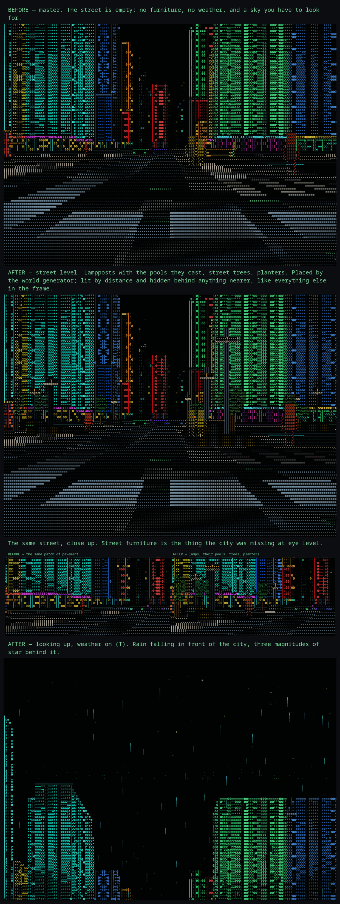

# Weather, and what is on the pavement

## Weather is drawn, not simulated

`T` cycles clear → rain → downpour.

Rain lives in a disc of sky dragged along with you and is drawn through the
same per-column wall buffer the pedestrians go through, so it falls *in front
of* the city and is hidden behind anything nearer, with the same distance
falloff as everything else. It leans with your own velocity — straight down at
a standstill, slanting past you at a run. There is no world-sized array of
drops and nothing off-screen is paid for.

The star field is the same idea in the other direction: three magnitudes off a
lattice hash, computed per frame, never stored. A handful of stars per screen
are drawn bright and near-white, the rest are faint, and the seven rows above
the horizon are a haze band where the city's own light washes the sky out.

Rain is a street-level thing in this engine: drops fall from 12 units and the
vista deck is at 34, so a hold on the skyline comes out dry however wet the
walk was.

## Street furniture

Placed by the world generator (`World::props_near`), not painted on afterwards:
lamps just inside the kerb, trees against the building line, planters on the
forecourt — all pure functions of position like every other feature of this
city.

It is **enumerated, not searched for**. `props_near` walks the four known
cross-offsets of an avenue at a known spacing along it — a few hundred
candidates a frame — instead of scanning the ground for somewhere a lamp could
stand, which would be tens of thousands of `cell()` calls. The cheap rejections
(distance, the leave-a-gap hash) go in front of `cell()`, which is the only
expensive call in that loop.

Props are drawn as billboards through `Renderer::nearest`, the same per-column
wall buffer the population uses, and they are **not** solid: making a lamppost
a `Cell` with height would make it a wall you cannot walk past and would break
the raycaster's assumption that a column is a building. You can walk through a
lamppost. That is a known trade, not an oversight.

A street tree's canopy is **three tones of one green**, and the depth is in the
saturation rather than the hue: the leaves the light catches are vivid and lean
a shade warm, the ones in shadow drop to almost no chroma. The old canopy was
one flat yellow-green at one saturation, which is what made it read as grey
against a facade running full-chroma neon.

`life-and-feel.png` puts the empty street beside the inhabited one: lampposts
and the pools they cast, street trees and planters, and a sky with weather in
front of it and stars behind.

See [Performance](performance.md) for what weather costs.
