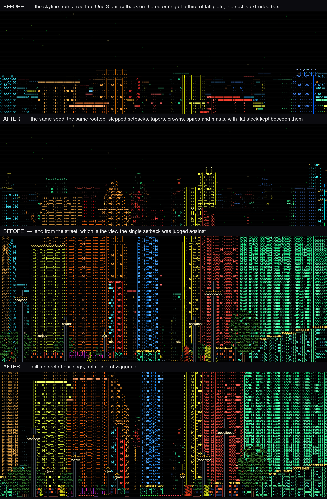
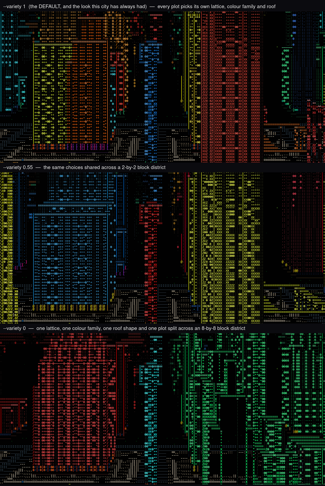

# Generating the city

Every cell of this city is a pure function of its coordinate — see
[The shape of the engine](architecture.md). This page is about what that
function decides: how tall a building is, what shape it is, and how much one
plot is allowed to differ from its neighbour.

## Building silhouettes

The world is a **height field** — one height per cell — so a building is an
extruded prism unless the cells *within* its plot are given different heights.
For a long time that happened barely at all: one 3-unit setback, on the
outermost ring, on 35% of plots over 20 units. From the street that was enough.
From a rooftop, where the skyline is what you are looking at, it read as a
field of flat-topped boxes.

Tall plots now get one of six profiles, and the mix is as much of the design as
the shapes are:

| | |
|---|---|
| **flat** | ~30% of tall stock, kept flat on purpose |
| **stepped** | two or three setback rings, so the tower steps in as it rises |
| **tapered** | a continuous narrowing to a crown (`arch` 1) |
| **crowned** | a flat body with a smaller block set on top |
| **spired** | a needle with a shoulder under it (`arch` 2) |
| **masted** | a thin mast on the middle of an otherwise flat roof (`arch` 3) |

`Cell::arch` comes out of the same decision rather than off its own hash, which
is what makes a spire a spire in **outline** and not only in texture — and a
plot built round a courtyard has no middle to stand one on, so it is never
offered one. Everything under 20 units stays flat or nearly so, and building
heights themselves are untouched, so there is still a baseline for a stepped or
spired tower to stand out against.

`silhouettes.png` is the same seed from the same rooftop, and the same seed
from the same street, before and after:



There is no flag for this — it is how the world generates. The picture worth
judging it from is the elevated vista, which is where a skyline is:

```bash
cargo run --release -- --vista --seed 703703 --eye 40 --pitch -0.10 \
    --at 4090,4062 --yaw 0 --no-plates --out docs/frames --name skyline-after
```

## Facade variety

A `--seed` has always chosen *which* mix of facades you get. It has never
chosen *how much* mixing there is, and a city where every plot picks
independently reads busier than one where a district agrees with itself.

`--variety` is that knob:

```bash
cargo run --release -- --variety 1      # the default: every plot for itself
cargo run --release -- --variety 0.55   # choices shared across a 2x2 district
cargo run --release -- --variety 0      # one district, one look
```

At `1` every plot picks its own window lattice, colour family, roof shape and
plot split. Turn it down and those four choices are shared across progressively
larger districts: 1 block at 0.65, 2 at 0.45, 3 at 0.28, 5 at 0.12 and 8 at 0 —
where an 8-by-8 block district reads as one regular grid.

It deliberately leaves the **height** mix alone at every setting: a district of
identical towers reads as a wall rather than as a city. What goes uniform is
pattern and colour.

`variety.png` is the same seed from the same rooftop at three settings. `--at`
fixes the camera, because the same seed under two settings is not quite the
same city and a searched viewpoint would stand in two different places:



```bash
cargo run --release -- --vista --seed 703703 --eye 34 --pitch -0.32 \
    --at 4090,4062 --yaw 0 --variety 0 --out docs/frames --name variety-0.0
```

## Height mix

Most of what you see down a long avenue should be a tower — twenty-plus
storeys — with enough mid- and low-rise to break the roofline. Nothing in the
city is taller than 52 units; the raycaster's occlusion cull leans on that, so
it is a true bound rather than a hope.

## The street surface

An avenue is 16 cells across: pavement out to the kerb at 4, roadway 5–10, kerb
at 11, pavement beyond. Centre lines land at 7 and 8 and lane dashes at 6 and
9, so the markings read as a carriageway from a standing eye. A minority of
pavement runs are painted forecourt or planted verge, in runs of three cells so
they read as markings rather than as fields — roughly 110:105:33:13 across
roadway / pavement / painted / greenery, which is what gives the lower half of
the frame something to striate instead of one flat grey.
